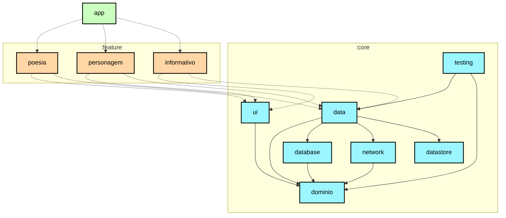

# Roteiro de aprendizado sobre modularização

Neste roteiro vamos aprender sobre modularização e a estratégia de modularização
usada para criar os módulos no aplicativo Felynos.

## Visão geral

Modularização é a prática de dividir o conceito de um código monolítico de um único módulo em
módulos autocontidos e de acoplamento baixo.

### Benefícios da modularização

Isso oferece muitos benefícios, incluindo:

**Escalabilidade** - Em um código de acoplamento alto, uma única alteração pode causar uma cascata
de alterações. Um projeto modularizado corretamente abraçará o princípio
da [separação de interesses](https://en.wikipedia.org/wiki/Separation_of_concerns). Isso, por sua
vez, capacita os contribuidores com mais autonomia, ao mesmo tempo que impõe padrões de arquitetura.

**Permitir trabalho em paralelo** - A modularização ajuda a diminuir os conflitos de controle de
versão e permite um trabalho em paralelo mais eficiente para desenvolvedores em equipes maiores.

**Propriedade** - Um módulo pode ter um proprietário dedicado, responsável por manter o código e os
testes, corrigir bugs e revisar alterações.

**Encapsulamento** - Código isolado é mais fácil de ler, entender, testar e manter.

**Tempo de compilação reduzido** - Aproveitar a compilação paralela e incremental do Gradle pode
reduzir os tempos de compilação.

**Entrega dinâmica** - A modularização é um requisito para
o [Play Feature Delivery](https://developer.android.com/guide/playcore/feature-delivery), que
permite que determinados recursos do seu aplicativo sejam entregues condicionalmente ou baixados sob
demanda.

**Suporte a Variações do Produto (Product Flavors)** - A estrutura modular facilita a criação de diferentes versões ou "sabores" do aplicativo (como o flavor "Felynos" do Felynos), incluindo ou excluindo módulos de feature específicos para cada variação.

**Reutilização** - A modularização adequada permite oportunidades de compartilhamento de código e
construção de vários aplicativos, em diferentes plataformas, a partir da mesma base.

### Armadilhas da modularização

No entanto, a modularização é um padrão que pode ser mal utilizado, e existem algumas armadilhas a
serem observadas ao modularizar um aplicativo:

**Muitos módulos** - cada módulo tem uma sobrecarga que se manifesta na forma de maior complexidade
da configuração de compilação. Isso pode fazer com que os tempos de sincronização do Gradle aumentem
e acarreta um custo de manutenção contínuo. Além disso, adicionar mais módulos aumenta a
complexidade da configuração do Gradle do projeto, quando comparado a um único módulo monolítico.
Isso pode ser mitigado com o uso de plugins de convenção, para extrair configurações de compilação
reutilizáveis e combináveis em código Kotlin seguro em termos de tipo. No aplicativo Felynos,
esses plugins de convenção podem ser encontrados na pasta `build-logic`.

**Módulos insuficientes** - inversamente, se seus módulos forem poucos, grandes e fortemente
acoplados, você acaba com outro monólito. Isso significa que você perde alguns benefícios da
modularização. Se o seu módulo estiver inchado e não tiver um propósito único e bem definido, você
deve considerar dividi-lo.

**Muito complexo** - não existe uma solução mágica aqui. Na verdade, nem sempre faz sentido
modularizar seu projeto. Um fator dominante é o tamanho e a complexidade relativa da base de código.
Se não se espera que seu projeto cresça além de um certo limite, os ganhos de escalabilidade e tempo
de compilação não se aplicarão.

## Estratégia de modularização

É importante notar que não existe uma única estratégia de modularização que sirva para todos os
projetos. No entanto, existem diretrizes gerais que podem ser seguidas para garantir que você
maximize seus benefícios e minimize suas desvantagens.

Um módulo básico é simplesmente um diretório com um script de compilação Gradle dentro. Normalmente,
porém, um módulo consistirá em um ou mais conjuntos de origem e, possivelmente, uma coleção de
recursos ou ativos. Os módulos podem ser construídos e testados independentemente. Devido à
flexibilidade do Gradle, existem poucas restrições quanto à forma como você pode organizar seu
projeto. Em geral, você deve buscar baixo acoplamento e alta coesão.

* **Baixo acoplamento** - Os módulos devem ser o mais independentes possível uns dos outros, para
  que as alterações em um módulo tenham impacto zero ou mínimo em outros módulos. Eles não devem
  possuir conhecimento do funcionamento interno de outros módulos.
* **Alta coesão** - Um módulo deve compreender uma coleção de código que atua como um sistema. Ele
  deve ter responsabilidades claramente definidas e permanecer dentro dos limites de determinado
  conhecimento de domínio. Por exemplo, o módulo 
  `core:network` é responsável por fazer requisições de rede, lidar com respostas de uma fonte de dados remota e
  fornecer dados para outros módulos.

## Tipos de módulos Felynos

**Dica principal**: O gráfico mostrado acima é útil durante o planejamento da
modularização para visualizar as dependências entre os módulos.

O aplicativo Felynos contém os seguintes tipos de módulos:

* O módulo `app` - contém classes de nível de aplicativo e de scaffolding que unem o restante da
  base de código, como `MainActivity`, `Application` e navegação controlada no nível
  do aplicativo. Um
  bom exemplo disso é a configuração da navegação por meio de `NavHost` e a configuração da barra
  de navegação inferior por meio de `TopLevelDestination`. O módulo `app` depende de todos os
  módulos `feature` e dos módulos `core` necessários.
* Módulos `feature:` - módulos específicos de recursos que são escopo para lidar com uma única
  responsabilidade no aplicativo. Esses módulos podem ser reutilizados por qualquer aplicativo,
  incluindo aplicativos de teste ou outras variações (flavors), quando necessário, enquanto ainda o
  mantém separado e isolado. Se uma classe for necessária apenas por um módulo `feature`, ela deverá
  permanecer nesse módulo. Caso contrário, ela deve ser extraída para um módulo `core` apropriado.
  Um módulo `feature` não deve ter dependências de outros módulos de feature. Eles dependem apenas
  dos módulos `core` de que precisam.
* Módulos `core:` - módulos de biblioteca comuns contendo código auxiliar e dependências específicas
  que precisam ser compartilhadas entre outros módulos no aplicativo. Esses módulos podem depender
  de outros módulos core, mas não devem depender de módulos feature nem de app.
* Módulos diversos - como módulos `benchmark` e `test`.

## Módulos

Usando a estratégia de modularização acima, o aplicativo Felynos possui os seguintes módulos:

<table>
  <tr>
   <td><strong>Nome</strong>
   </td>
   <td><strong>Responsabilidades</strong>
   </td>
   <td><strong>Classes chave e bons exemplos</strong>
   </td>
  </tr>
  <tr>
   <td><code>app</code>
   </td>
   <td>Reúne tudo o que é necessário para o aplicativo funcionar corretamente. Isso inclui scaffolding de UI e navegação.
   </td>
   <td><code>MainActivity</code> 
   Navegação controlada no nível do aplicativo via <code>NavHost, AppState, TopLevelDestination</code>
   </td>
  </tr>
  <tr>
   <td><code>feature:poesia,</code> 
   <code>feature:personagem</code> <code>feature:informativo</code> 
   ...
   </td>
   <td>Funcionalidade associada a um recurso específico ou jornada do usuário. Normalmente contém componentes de UI e ViewModels que leem dados de outros módulos. 
   Exemplos incluem: 
   <ul>
      <li>`feature:poesia` (responsável pela funcionalidade de poemas), </li><li>`feature:personagem` (para detalhes de personagens) e </li><li>`feature:informativo` (para textos informativos).</li>
   </ul>
   </td>
   <td><code>PoesiaScreen</code> 
   <code>PoesiaViewModel</code>
   </td>
  </tr>
  <tr>
   <td><code>core:data</code>
   </td>
   <td>Contém Entities, DAOs, Repositorys. Busca de dados do aplicativo de várias fontes, compartilhados por diferentes recursos.
   </td>
   <td><code>PoesiaEntity</code> <code>PoesiaDao</code> <code>PoesiaRepository</code> 
   </td>
  </tr>
  <tr>
   <td><code>core:ui</code>
   </td>
   <td>Componentes de UI compostos e recursos usados por módulos de feature (muitos dos quais são componentes Material 3 personalizados), tema do aplicativo e classes utilitárias.
   </td>
   <td>
   <code>Theme</code>
   </td>
  </tr>
  <tr>
   <td><code>core:dominio</code>
   </td>
   <td>Classes comuns compartilhadas entre módulos.
   </td>
   <td>
   <code>Result</code>
   </td>
  </tr>
  <tr>
   <td><code>core:network</code>
   </td>
   <td>Realização de requisições de rede e tratamento de respostas de uma fonte de dados remota.
   </td>
   <td><code>ApiService</code>
   </td>
  </tr>
  <tr>
   <td><code>core:testing</code>
   </td>
   <td>Dependências de teste, repositórios e classes utilitárias.
   </td>
   <td>
   </td>
  </tr>
  <tr>
   <td><code>core:datastore</code>
   </td>
   <td>Armazenamento de dados persistentes das preferências do usuário.
   </td>
   <td><code>Preferências</code>
   </td>
  </tr>
  <tr>
   <td><code>core:database</code>
   </td>
   <td>Armazenamento em banco de dados local usando Room.
   </td>
   <td><code>felynes.db</code> 
   <code>DatabaseMigrations</code> 
   </td>
  </tr>
</table>

## Modularização Felynos

Nossa abordagem de modularização foi definida levando em consideração o roadmap do projeto
“Felynos”, trabalhos futuros e novos recursos. Além disso, nosso objetivo desta vez foi encontrar o
equilíbrio certo entre modularizar excessivamente um aplicativo relativamente pequeno e usar esta
oportunidade para apresentar um padrão de modularização adequado para uma base de código muito
maior, mais próxima dos aplicativos do mundo real em ambientes de produção. Nossa abordagem é uma
diretriz geral que consideramos ser a mais adequada para o nosso projeto.